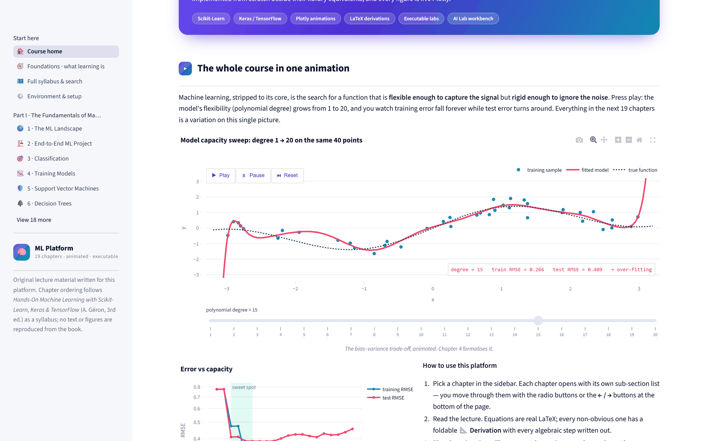
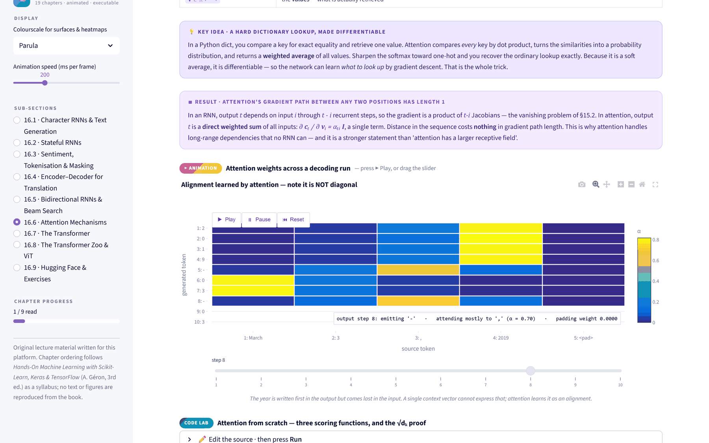
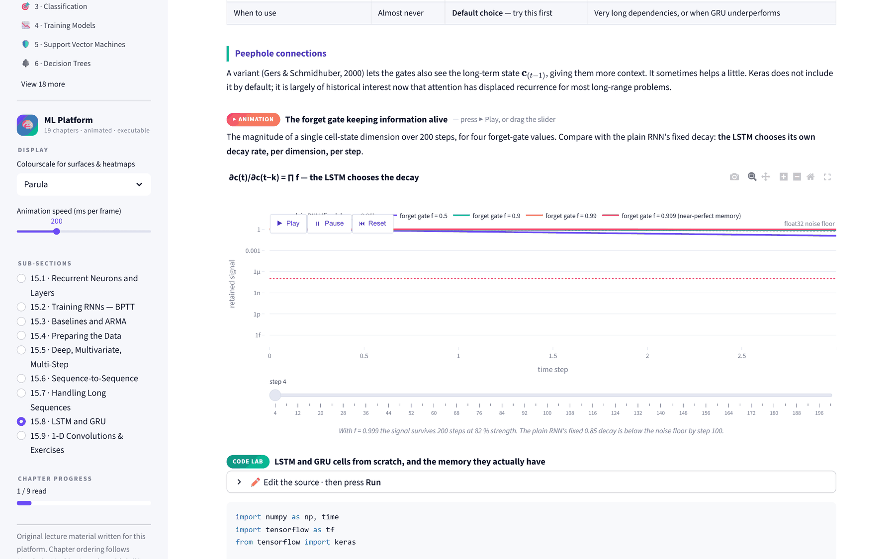
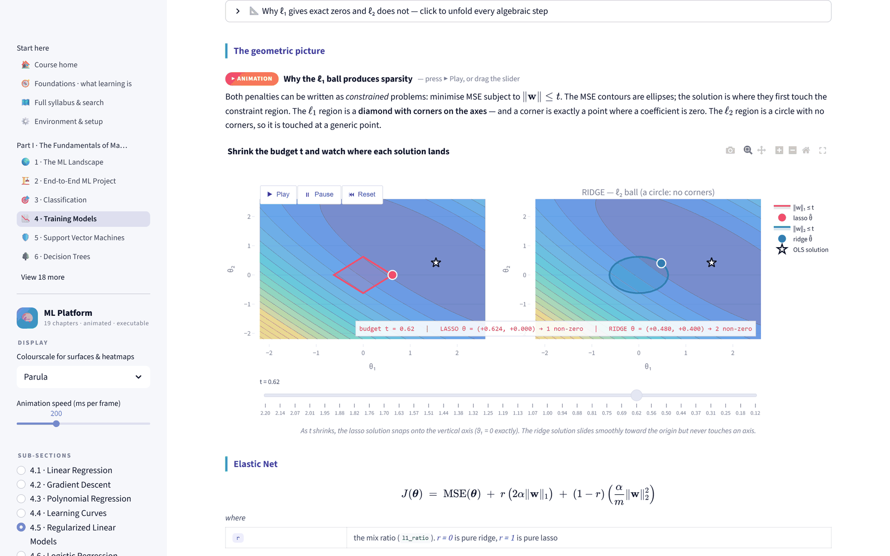
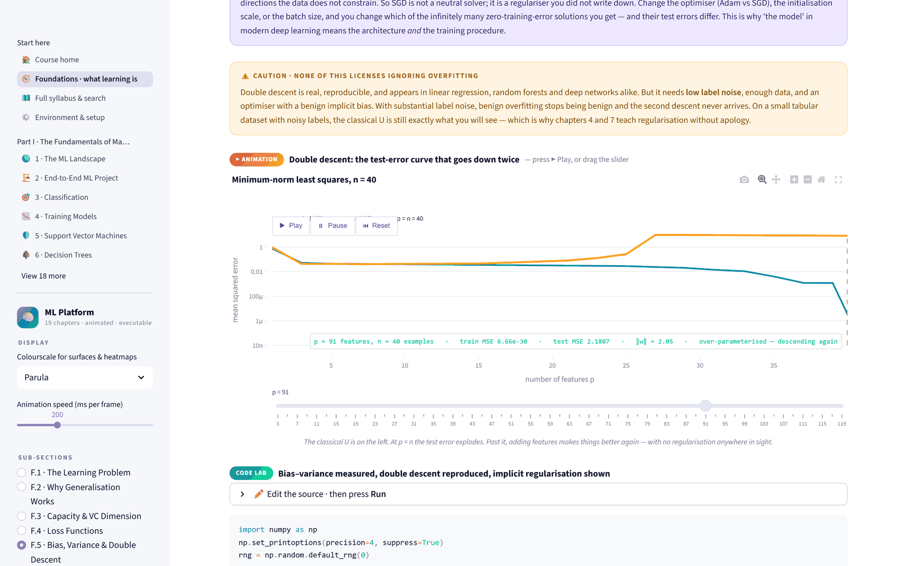
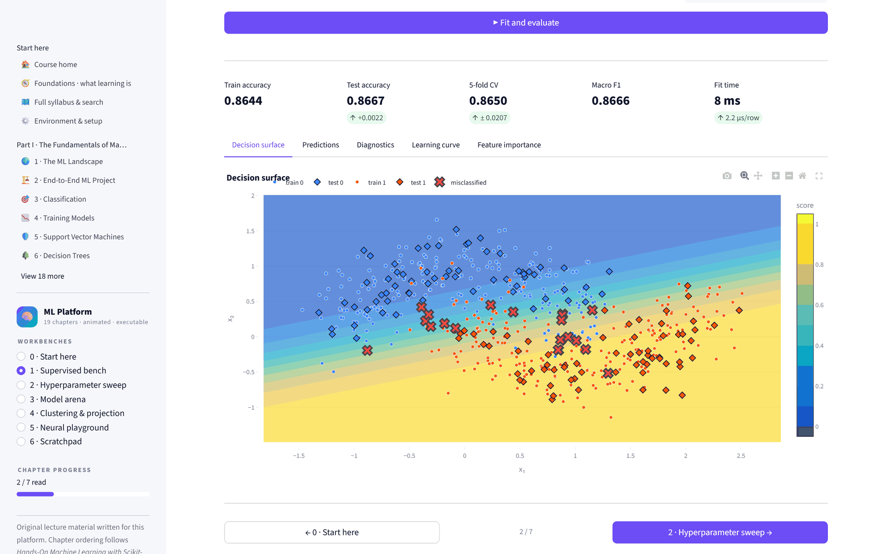
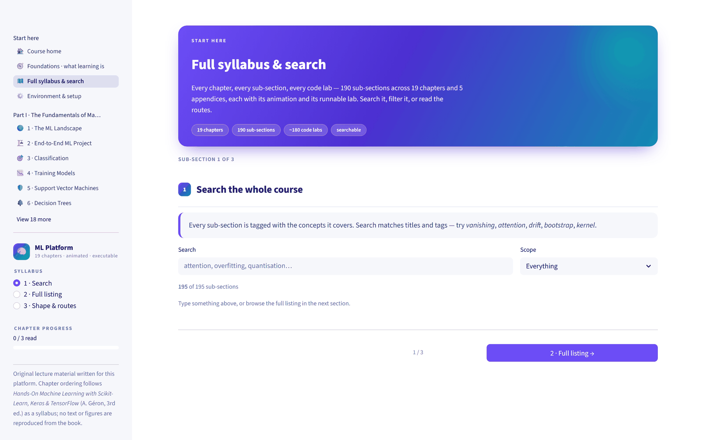
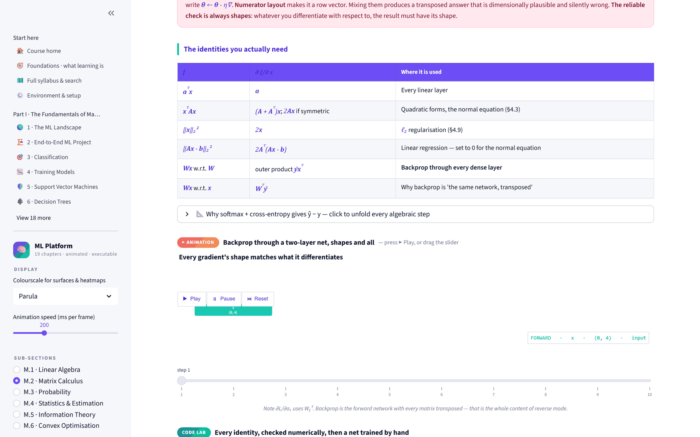

# ML Platform

**by Dr Merwan Roudane**

[](https://github.com/merwanroudane)
[](https://www.python.org/)
[](https://streamlit.io/)
[](#course-contents)
[](#using-the-code-labs)

An interactive, executable machine-learning course. Nineteen chapters and five
appendices, **203 sub-sections**, each carrying a full lecture, the mathematics
written out rather than cited, a Plotly animation you drive with a play button,
and a code lab you can edit and run without leaving the page.

Built with Streamlit. Runs offline. Nothing is abbreviated.

```bash
git clone https://github.com/merwanroudane/ai_labs.git
cd ai_labs
pip install -r requirements.txt
streamlit run app.py
```

Opens on <http://localhost:8501>.

---

## Table of contents

- [What this is](#what-this-is)
- [Screenshots](#screenshots)
- [At a glance](#at-a-glance)
- [Installation](#installation)
- [The anatomy of a sub-section](#the-anatomy-of-a-sub-section)
- [Course contents](#course-contents)
  - [Foundations](#foundations--what-learning-actually-is)
  - [Part I — The Fundamentals of Machine Learning](#part-i--the-fundamentals-of-machine-learning)
  - [Part II — Neural Networks and Deep Learning](#part-ii--neural-networks-and-deep-learning)
  - [Labs and reference](#labs-and-reference)
- [Using the code labs](#using-the-code-labs)
- [The AI Lab](#the-ai-lab)
- [Reading routes](#reading-routes)
- [Architecture](#architecture)
- [The lecture DSL](#the-lecture-dsl)
- [Datasets](#datasets)
- [Colour and theming](#colour-and-theming)
- [Deploying](#deploying)
- [Testing](#testing)
- [Extending the platform](#extending-the-platform)
- [Performance notes](#performance-notes)
- [Troubleshooting](#troubleshooting)
- [Sources and originality](#sources-and-originality)
- [Author](#author)

---

## What this is

Most machine-learning courses make you choose between three things: a readable
explanation, the actual mathematics, and code you can run. This one refuses the
choice. Every sub-section has all three, plus an animation, and they sit on the
same page — so you can read a derivation and immediately run the thing it
describes.

Three commitments shape the whole platform.

**Derivations are written out.** Where a result is stated, its derivation is
given step by step, and each step says what changed and why. The ELBO comes from
Jensen's inequality. The √dₖ in scaled dot-product attention comes from a
variance calculation. The LSTM's gradient behaviour comes from differentiating
the cell-state update. No step is left as an exercise unless it genuinely is one.

**Claims are checked, not asserted.** Where the lecture states a theoretical
result, the lab measures it. Hoeffding's bound is verified for both coverage and
looseness. The bias–variance decomposition is shown summing to the observed MSE
to two decimal places. The VC bound is shown holding while being 30–300× too
loose. The winner's curse is shown tracking σ√(2 ln K). Distance concentration
is shown following 1/√(2d). If the platform tells you something is true, there
is a cell you can run that demonstrates it.

**Algorithms are built before they are called.** A SimpleRNN cell, an LSTM cell,
a GRU, multi-head attention, a reverse-mode autodiff engine, beam search, BPE
tokenisation, PPO's clipped objective, DDPM sampling — each is implemented from
scratch in NumPy and then checked against the library version, usually agreeing
to around 1e-6. The library stops being magic.

---

## Screenshots

**The course home** — every chapter opens with an animation you drive. Here the
polynomial degree sweeps 1 → 20 and you watch training error fall forever while
test error turns around.



**A lecture** — prose, real KaTeX mathematics, and the callouts that carry the
warnings worth having: a result, a common pitfall, a table of sampling
strategies.



**An animation** — ▶ Play, ⏸ Pause, ⏮ Reset and a scrub slider on every one.
This is §15.8 showing how an LSTM's forget gate chooses its own decay rate.



**A code lab** — editable, runnable, with a persistent namespace. Every lab sits
directly under the derivation it demonstrates.



**The Foundations appendix** — double descent reproduced in plain least squares,
annotated live: at *p* = 91 features on *n* = 40 examples the training error is
6.7 × 10⁻³⁰ and the test error is still falling.



**The AI Lab** — six workbenches. The supervised bench fits any of 13 models
with every hyperparameter exposed, then shows the decision surface, the
metrics, and the misclassified points.



**The searchable syllabus** — every sub-section tagged by concept.



**The mathematics appendix** — matrix calculus with each identity checked
numerically in the lab beneath it.



---

## At a glance

| | |
|---|---|
| **Pages** | 28 |
| **Sub-sections** | 203 |
| **Animations** | one per sub-section, ▶ Play plus a scrub slider |
| **Code labs** | 171, editable and runnable in the page |
| **Lines of Python** | ~66 900 (64 400 in `views/`, 2 100 in `core/`) |
| **Chapters** | 19, in two parts |
| **Appendices** | Foundations, Mathematics, Project checklist, Autodifferentiation, Glossary |
| **Workbenches** | 6, in the AI Lab |
| **External services required** | none — runs entirely offline |

---

## Installation

### Two requirements files

| File | For | Contains |
|---|---|---|
| `requirements.txt` | **Deployment** (Streamlit Cloud) | Core + `tensorflow-cpu` + `statsmodels`. Deliberately lean. |
| `requirements-local.txt` | **Local development** | The above plus every optional package |

```bash
pip install -r requirements-local.txt      # local, everything
pip install -r requirements.txt            # or just what deploys
```

Core requirements — the platform will not start without them:

| Package | Why |
|---|---|
| `streamlit >= 1.40` | The `st.navigation` multipage API |
| `numpy >= 1.26`, `pandas >= 2.0` | Everywhere |
| `plotly >= 5.20` | Every figure and every animation |
| `scikit-learn >= 1.4` | Chapters 1–9, and parts of 10–19 |
| `scipy >= 1.11` | Statistics in the maths appendix and §F.7 |
| `matplotlib >= 3.8` | A handful of labs that use `st.pyplot` |
| `tensorflow >= 2.16` | Chapters 10–19 |

### GPU

The requirements pin **`tensorflow-cpu`** on purpose. On Linux the plain
`tensorflow` wheel drags in the entire NVIDIA CUDA stack — `nvidia-cublas-cu12`,
`nvidia-cudnn-cu12` and friends, several GB of wheels. That is wasted on a
machine with no GPU, and it is enough to abort a Streamlit Cloud build.

For an actual GPU, replace that line with one of:

```bash
# Linux or WSL2 with an NVIDIA card
pip install "tensorflow[and-cuda]"

# macOS on Apple silicon
pip install tensorflow tensorflow-metal
```

TensorFlow dropped native-Windows GPU support at 2.11. On Windows the labs run
on CPU, which is fine — they are sized for it.

### Optional

Each of these affects exactly one lab. That lab detects the absence, prints the
`pip install` line, and continues with a fallback.

| Package | Used by |
|---|---|
| `statsmodels` | §15.3 — the SARIMA comparison |
| `sympy` | §B.1 — the symbolic-differentiation demonstration |
| `transformers` | §16.9 — the Hugging Face pipeline |
| `tensorboard` | §10.7 — the TensorBoard callback |
| `keras-tuner` | §10.8 — hyperparameter search |
| `tensorflow-datasets` | a few dataset loaders |

The **Environment & setup** page probes your machine live and reports what is
present, what is missing, and what each absence costs you.

---

## The anatomy of a sub-section

All 203 sub-sections share one shape:

| Element | What it is |
|---|---|
| **Lead** | One or two sentences framing what the sub-section is for |
| **Lecture** | Original prose, in sub-headed blocks |
| **Mathematics** | `st.latex` for display equations, with a `where:` block defining every symbol |
| **Derivation** | A numbered sequence; each step states what changed and why, not just the result |
| **Callouts** | 💡 idea · ⚠️ warning · 🕳 pitfall · ✅ tip · 📐 proof · 💻 code note |
| **Animation** | A Plotly figure with ▶ Play, ⏸ Pause, ⏮ Reset and a scrub slider |
| **Code lab** | Editable, runnable Python with a persistent namespace |
| **Quiz** | Where a specific misconception is common |
| **Key points** | Exactly five lines, at the end |

Chapters also carry **exercises** with full worked solutions, and a
**references** block linking the papers the results come from.

Every chapter page's sidebar gives you a sub-section picker, a progress bar, a
colourscale selector and an animation-speed slider.

---

## Course contents

### Foundations — what learning actually is

Read alongside chapters 1–4. This appendix answers the question the rest of the
platform assumes: *why is any of this justified?*

| § | Title | Covers |
|---|---|---|
| F.1 | The Learning Problem | ERM, hypothesis space, approximation/estimation/optimisation error, inductive bias, no-free-lunch stated properly |
| F.2 | Why Generalisation Works | i.i.d., Hoeffding, the union bound, uniform convergence, PAC, sample complexity |
| F.3 | Capacity & VC Dimension | Shattering, Sauer's lemma, Rademacher complexity, why the bounds are vacuous for deep nets |
| F.4 | Loss Functions | Bayes-optimal predictors per loss, surrogate losses, calibration, proper scoring rules |
| F.5 | Bias, Variance & Double Descent | The decomposition derived and measured, the interpolation threshold, implicit regularisation |
| F.6 | Optimisation Foundations | Smoothness, convexity, the condition number, Nesterov's lower bound, the SGD noise ball |
| F.7 | Evaluation & Uncertainty | Standard errors, McNemar, cross-validation variance, the winner's curse |
| F.8 | Data, Features & Geometry | Measurement scales, scale sensitivity, distance concentration, intrinsic dimension |
| F.9 | Vocabulary & Misconceptions | 22-term glossary, eight misconceptions, nine pre-flight questions, a capstone lab |

No-free-lunch is *measured* — five learners average exactly 0.5 over all 256
target functions on an 8-point domain, and nearest-neighbour then wins
decisively once you filter to structured targets. Double descent is reproduced
in plain least squares with no neural network anywhere. A one-parameter
classifier is shown shattering arbitrarily many points.

### Part I — The Fundamentals of Machine Learning

| # | Chapter | Sub-sections cover |
|---|---|---|
| 1 | The ML Landscape | Definitions; supervised, unsupervised, self-supervised and RL; batch vs online; instance vs model-based; the data challenges; the algorithm challenges; testing and validating |
| 2 | End-to-End ML Project | Framing; getting data; performance measures and norms; exploration; pipelines and leakage; shortlisting; fine-tuning; launch |
| 3 | Classification | MNIST; why accuracy is not enough; the confusion matrix; precision and recall; ROC and AUC as Mann–Whitney; multiclass; error analysis; multilabel |
| 4 | Training Models | The loss; the normal equation; SVD and the pseudoinverse; bias–variance and learning curves; gradient descent; SGD; polynomial regression; ridge; lasso and elastic net |
| 5 | Support Vector Machines | Margins; soft margin and C; nonlinear SVMs; the dual and KKT; kernels and Mercer; SVM regression; SMO; practical guidance |
| 6 | Decision Trees | CART; predictions; Gini vs entropy; regularisation; regression trees; instability and rotation sensitivity; cost-complexity pruning; feature importance |
| 7 | Ensembles & Random Forests | Voting; the ρσ² + (1−ρ)σ²/B variance formula; bagging and OOB; random forests; AdaBoost as forward-stagewise exponential loss; gradient boosting as functional gradient descent; histogram boosting and stacking |
| 8 | Dimensionality Reduction | The curse of dimensionality; manifolds; PCA by two derivations; choosing components; randomised and incremental PCA; Johnson–Lindenstrauss; LLE and t-SNE; kernel PCA |
| 9 | Unsupervised Learning | Clustering; k-means and Lloyd convergence; k-means++; choosing k; the limits of k-means; DBSCAN; other algorithms; Gaussian mixtures and EM derived from Jensen |

### Part II — Neural Networks and Deep Learning

| # | Chapter | Sub-sections cover |
|---|---|---|
| 10 | Intro to ANNs with Keras | Perceptron and XOR; the MLP; backpropagation; the Sequential API; regression MLPs; the Functional API; subclassing and callbacks; hyperparameter tuning |
| 11 | Training Deep Nets | Vanishing and exploding gradients; Glorot and He; activation functions; batch normalisation; gradient clipping; transfer learning; optimisers from momentum to AdamW; schedules and 1cycle; dropout and MC dropout |
| 12 | Custom Models & Training | Tensors and operations; variables, ragged and sparse structures; custom losses; custom activations and constraints; custom metrics; custom layers; custom models; `GradientTape` loops; `tf.function` and AutoGraph's rules |
| 13 | Loading & Preprocessing Data | The `tf.data` API; chaining; shuffling and pipeline order; TFRecord; protobufs; preprocessing features; Keras preprocessing layers and training/serving skew; embeddings and hashing collisions |
| 14 | Deep Computer Vision | The visual cortex; convolution arithmetic and memory; pooling; the LeNet→Inception lineage; ResNet and the degradation problem; Xception and SENet; transfer learning; object detection with IoU, NMS and YOLO; segmentation |
| 15 | Sequences with RNNs & CNNs | Recurrent neurons; BPTT derived; baselines and ARMA; windowing and leakage; deep, multivariate and multi-step; sequence-to-sequence; layer norm and unstable gradients; LSTM and GRU; dilated causal convolutions and WaveNet |
| 16 | NLP, Attention & Transformers | Character RNNs and sampling strategies; stateful RNNs; tokenisation and masking; encoder–decoder and teacher forcing; bidirectional RNNs and beam search; attention mechanisms; the Transformer; the model zoo and ViT; Hugging Face and LoRA |
| 17 | Autoencoders, GANs & Diffusion | Autoencoders as PCA; stacked and tied weights; convolutional and recurrent; denoising and the score identity; sparse autoencoders and interpretability; VAEs and the ELBO; GAN dynamics and mode collapse; DCGAN and StyleGAN; diffusion and classifier-free guidance |
| 18 | Reinforcement Learning | Rewards and credit assignment; policy search; REINFORCE and the log-derivative trick; MDPs and Bellman; TD and Q-learning; deep Q-learning and the deadly triad; double, dueling and prioritised; actor–critic and PPO; practice |
| 19 | Training & Deploying at Scale | SavedModel and serving signatures; latency and batching; TFLite and quantisation; GPUs and mixed precision; data vs model parallelism; distribution strategies; pipelines and cost; drift and retraining; the deployment checklist |

### Labs and reference

| | Contents |
|---|---|
| **AI Lab** | Six live workbenches — see below |
| **Mathematics appendix** | M.1 Linear algebra · M.2 Matrix calculus · M.3 Probability · M.4 Statistics and estimation · M.5 Information theory · M.6 Convex optimisation |
| **Appendix A** | The ML project checklist — 8 phases, 70+ checks, progress tracked in session state |
| **Appendix B** | B.1 Four ways to get a derivative · B.2 Forward mode and dual numbers · B.3 Reverse mode · B.4 Building an engine · B.5 `GradientTape` in practice · B.6 Reference |
| **Glossary** | 200+ terms, a symbol table, and a chapter dependency map |
| **Syllabus** | Every sub-section, searchable by concept tags |
| **Environment & setup** | Live probe of your Python, TensorFlow, GPU and optional packages |

Appendix B builds a working reverse-mode autodifferentiation engine in about
80 lines — scalar `Value` nodes with closures for local gradients — and then
trains a small neural network with it, checking every gradient against
`GradientTape`.

---

## Using the code labs

Each lab is a self-contained program, typically 150–280 lines, with four
controls:

| Control | Does |
|---|---|
| **▶ Run** | Executes the buffer in that lab's persistent namespace |
| **✏️ Edit the source** | Opens an editor — change anything, then Run |
| **↺ Restore** | Puts the original code back and clears the namespace |
| **🧹 Clear vars** | Empties the namespace, keeps your edits |

The namespace **persists between runs**, so after a lab finishes you can open
the editor, type `model.get_weights()[0].shape`, and press Run again to inspect
what you just built.

**Preloaded in every lab**, no imports needed:

```python
np, numpy, pd, pandas, px, go, make_subplots, st
C, SEQ, CLASS_COLORS, PARULA, alpha, ramp, scale, palette
nav
```

Labs additionally do `from core import datasets as ds` where they need data.

**Rendering.** Anything left in `fig`, `fig1`…`fig4` is rendered as a Plotly
chart. Matplotlib figures are picked up automatically. A trailing `result`,
`out`, `df`, `table` or `summary` holding a DataFrame or array is rendered as a
table.

**The labs are meant to be broken.** Set the regularisation to zero and watch
the coefficients explode. Delete the target network in the DQN lab and watch it
diverge. Remove a `+=` from the autodiff engine and see which gradient goes
wrong. Change `padding='causal'` to `padding='same'` in the WaveNet lab and
watch the validation score improve impossibly. Most labs are built so that a
specific sabotage produces a specific, legible failure.

---

## The AI Lab

Six workbenches that let you drive models directly, with no code required.

| Workbench | What it does |
|---|---|
| **Supervised bench** | 13 models across classification and regression, every hyperparameter exposed. Decision surfaces, confusion matrices, ROC and PR curves, calibration plots, learning curves, residual diagnostics, permutation importance |
| **Hyperparameter sweep** | Sweep any one parameter and watch train and validation curves separate in real time |
| **Model arena** | Race every model on one dataset; accuracy-versus-fit-time scatter to make the cost explicit |
| **Clustering & projection** | k-means, DBSCAN, agglomerative and GMM against PCA, kernel PCA, t-SNE, LLE and Isomap; silhouette analysis |
| **Neural playground** | Build an MLP layer by layer and watch per-layer gradient norms and activation saturation while it trains |
| **Scratchpad** | A blank persistent Python cell with every dataset and helper preloaded |

---

## Reading routes

| Goal | Route | Roughly |
|---|---|---|
| A complete pass | F → 1 → 19, with M and B alongside | The whole thing |
| Tabular data, fast | 1 → 2 → 3 → 4 → 6 → 7 → 19 | 7 chapters |
| Deep learning foundations | 4 → 10 → 11 → B → 12 → 13 | 6 chapters |
| Computer vision | 10 → 11 → 13 → 14 → 17 | 5 chapters |
| NLP | 10 → 11 → 13 → 15 → 16 | 5 chapters |
| Generative models | 10 → 11 → 14 → 17 | 4 chapters |
| Reinforcement learning | 4 → 10 → 11 → 18 | 4 chapters |
| Shipping a model | 2 → 13 → 19 → A | 3 chapters + the checklist |
| The theory, on its own | F → M → B | 3 appendices |

**A suggestion on how to read it.** Each sub-section ends with exactly five key
points. Reading only those, for a whole chapter, takes about two minutes and
tells you which sub-sections you already know. Then read the ones you do not,
and run their labs. That is a better use of an afternoon than reading linearly
from the top.

---

## Architecture

```
ml_platform/
├── app.py                  entry point; the st.navigation tree
├── requirements.txt
├── README.md
├── .streamlit/config.toml  theme and server settings
│
├── core/                   2 100 lines — the platform itself
│   ├── palette.py          colours, MATLAB Parula, five colourscales
│   ├── theme.py            the Plotly template and all the CSS
│   ├── lecture.py          the lecture DSL + a LaTeX→Unicode converter
│   ├── anim.py             play/pause/reset controls and frame helpers
│   ├── runner.py           the in-page Python execution engine
│   ├── nav.py              sub-section navigation and progress tracking
│   ├── datasets.py         20 cached datasets with offline fallbacks
│   └── rl.py               self-contained CartPole, GridWorld and MDPs
│
├── views/                  64 400 lines — one file per page
│   ├── p00_home.py         course home, with an animated hero
│   ├── p01…p19_*.py        the nineteen chapters
│   ├── p20_ai_lab.py       the six workbenches
│   ├── p21_math.py         mathematics appendix
│   ├── p22_checklist.py    project checklist
│   ├── p23_autodiff.py     autodifferentiation appendix
│   ├── p24_glossary.py     glossary, symbols, dependency map
│   ├── p25_foundations.py  foundations appendix
│   ├── p90_syllabus.py     searchable syllabus
│   └── p91_setup.py        environment probe
│
├── smoke_test.py           renders every page and sub-section headlessly
├── lab_test.py             executes every code lab
└── runlabs.py              executes named labs from one page
```

**Why `views/` and not `pages/`.** Streamlit auto-discovers a `pages/`
directory and builds its own navigation from it, which would fight the
`st.navigation` tree declared in `app.py`. Naming it `views/` prevents that.

**`core/rl.py`** implements CartPole, a grid world and tabular MDPs from
scratch, so chapter 18 has no dependency on Gymnasium and behaves identically on
every machine.

---

## The lecture DSL

Chapter pages are written against a small vocabulary in `core/lecture.py`, which
is why 64 000 lines of content stay consistent.

```python
hero(kicker, title, blurb, chips)      # page header
section(num, title)                    # sub-section heading
sub(title)                             # a heading inside a sub-section
lead(text)                             # the framing sentence
md(text)                               # prose

math(expr, caption=None)               # a display equation
where({symbol: meaning, ...})          # symbol definitions
derive(steps, title="Derivation")      # steps = [(prose, latex_or_None), ...]

idea(title, body)                      # 💡  a conceptual insight
tip(title, body)                       # ✅  practical guidance
note(title, body)                      # ℹ️  an aside
warn(title, body)                      # ⚠️  something that will bite you
pitfall(title, body)                   # 🕳  a specific, common mistake
proof(title, body)                     # 📐  a short argument
codenote(title, body)                  # 💻  an API detail

table(headers, rows, caption=None)
figure(fig, caption=None)
anim_header(title, hint)
keypoints(items, title="What to remember")
quiz(question, options, answer, explanation, key)
exercise(number, prompt, solution, code=None)
refs([(label, url), ...])
```

Every callout also accepts a single argument, in which case it renders as a
one-line note.

**The LaTeX problem, and `tex()`.** Streamlit renders `st.latex` through KaTeX,
but KaTeX does not run inside HTML injected with `unsafe_allow_html`. Tables and
callouts *are* injected HTML, so `$...$` inside them would render literally.
`core.lecture.tex()` converts a useful subset of LaTeX to Unicode — Greek
letters, script and blackboard-bold, sub- and superscripts, `\frac`, combining
accents and the common operators — and it is applied automatically inside every
HTML-emitting helper. Display equations still go through `st.latex` and get full
KaTeX.

**Animations.** `core.anim.animate(fig, frames, duration=..., slider_prefix=...)`
attaches the frames, builds the ▶ / ⏸ / ⏮ buttons and a scrub slider, and
reserves margin so the controls never collide with the title. Speed is
controlled globally from the sidebar via `nav.anim_ms()`.

---

## Datasets

`core/datasets.py` exposes 20 cached factories. Every one is `@st.cache_data`,
has stable shapes and column names, and falls back to a synthetic generator if a
download is unavailable — so the platform works with no network connection.

| Group | Functions |
|---|---|
| **Synthetic 1-D/2-D** | `linear_1d` `quadratic_1d` `sine_1d` `moons` `circles` `blobs` `anisotropic_blobs` |
| **Manifolds** | `swiss_roll` `s_curve` |
| **Classic tabular** | `iris` `digits` `breast_cancer` `wine` `housing` |
| **Images** | `fashion_mnist` |
| **Time series** | `ridership` (weekly and annual seasonality, trend, holiday dips) · `ar_series` |
| **Text** | `char_corpus` `sentiment_corpus` `date_pairs` |

The three text datasets are generated from hand-written grammars rather than
scraped, so they carry real learnable structure — spelling, negation, contrast,
non-monotone alignment — with no copyright attached. `date_pairs` produces
`"March 3, 2019" → "2019-03-03"` in four input formats; the alignment is
deliberately non-monotonic, which is what makes the attention maps in §16.6
legible.

---

## Colour and theming

`core/palette.py` reproduces **MATLAB's R2014b Parula** colormap from its 64 RGB
stops, alongside Jet, Turbo, Blue–Red and a custom Sinha scale. Parula is the
default for every surface, heatmap and contour, and the colourscale is
switchable from the sidebar on any chapter page.

```python
from core.palette import C, SEQ, CLASS_COLORS, PARULA, alpha, ramp, scale

C["primary"]        # #6C4DF6
C["accent"]         # #00C2A8
C["train"], C["valid"], C["test"], C["truth"], C["pred"]
SEQ                 # 12-colour categorical sequence
alpha("#6C4DF6", .3)
```

The semantic role colours (`train`, `valid`, `test`, `truth`, `pred`) are used
consistently across all 203 sub-sections, so a blue line means the same thing in
chapter 4 as it does in chapter 19.

---

## Deploying

### Streamlit Community Cloud

Point it at `app.py` on the `main` branch. `runtime.txt` pins Python 3.11 and
`requirements.txt` is already sized for the platform's limits.

Two things matter, and both are already handled in this repository:

**Use `tensorflow-cpu`, never `tensorflow`.** On Linux the plain wheel resolves
the CUDA dependencies and downloads several GB. Cloud's build disk is smaller
than that, so pip aborts and you get *"Error installing requirements"* with
`installer returned a non-zero exit code` in the log.

**Do not import TensorFlow at page load.** Every chapter page checks whether
TensorFlow is available so it can warn you if it is not. Doing that with
`import tensorflow` costs roughly 500 MB of resident memory against Cloud's
1 GB ceiling — before a single lab has run. The pages use
`importlib.util.find_spec("tensorflow")` instead, which answers the same
question for nothing. As a side effect, chapter pages load two to three times
faster.

The optional packages — `transformers`, `tensorflow-datasets`, `keras-tuner`,
`tensorboard`, `sympy` — are deliberately **not** in the deployment
requirements. The five labs that use them detect the absence, print the install
command and fall back, so nothing breaks.

### Anywhere else

```bash
pip install -r requirements-local.txt
streamlit run app.py --server.port 8501
```

Nothing else is needed. The platform has no database, no API keys and no
network calls at runtime — every dataset either ships with scikit-learn or is
generated from a seeded RNG.

---

## Testing

Two harnesses, because they catch completely different failures.

```bash
python smoke_test.py                  # render every page and sub-section
python smoke_test.py p04 p05          # only these pages

python lab_test.py                    # execute every code lab
python lab_test.py p15 p16            # only these pages
python lab_test.py --list             # list labs without running them

python runlabs.py views/p15_rnn.py ch15_lstm     # one lab, by name
```

`smoke_test.py` uses `streamlit.testing.v1.AppTest` to walk every sub-section of
every page headlessly. It catches rendering errors, bad figure specs and DSL
misuse.

`lab_test.py` extracts every `code_lab(...)` string via the AST and actually
executes it. **This is the one that matters.** It is what catches library API
drift, and during development it found roughly forty real bugs that page
rendering never would have surfaced: scikit-learn 1.8 removing `multi_class=`
and `algorithm=`; NumPy 2 removing `ndarray.ptp()` and `np.trapz`; Keras 3
moving `reset_states()` from the model to the layer and returning lists from
`evaluate()`; and AutoGraph refusing to trace functions defined in `exec`'d
strings.

Run both after any edit.

---

## Extending the platform

To add a chapter:

1. Create `views/pNN_name.py`.
2. Import the DSL, call `inject()`, set `CH = "chNN"`, and call `hero(...)`.
3. Write one function per sub-section.
4. End with:

```python
SECTIONS = [
    ("20.1", "First sub-section", s_20_1),
    ("20.2", "Second sub-section", s_20_2),
]
nav.render_chapter(CH, SECTIONS)
```

5. Register it in `app.py`'s `NAV` dict.
6. Add it to `SYLLABUS` in `views/p90_syllabus.py` with concept tags so it
   becomes searchable.
7. Run `python smoke_test.py pNN` and `python lab_test.py pNN`.

Conventions worth keeping: one animation and one lab per sub-section; exactly
five key points; every lab should run in well under a minute on CPU; and every
derivation step must say what changed, not merely state the next line.

---

## Performance notes

The labs are sized so that pressing Run is not a commitment. Most finish in
under 30 seconds on CPU. The exceptions, all in Part II:

| Lab | Approx. CPU time | Why |
|---|---|---|
| `ch17_gan` | ~10 min | Five GAN configurations trained to show mode collapse |
| `ch17_diffusion` | ~7 min | A DDPM trained far enough to sample |
| `ch17_dcgan` | ~4 min | Convolutional GAN on 28×28 images |
| `ch15_lstm` | ~4 min | The copy task at T = 10…120 for three cell types |
| `ch19_scale` | ~2 min | Pipeline throughput measured under four configurations |

Every one of them exposes its `epochs` / `steps` / dataset size as a named
constant near the top, so the editor is the throttle. If you only want to read,
every explanation and animation works without running anything.

---

## Troubleshooting

**`StreamlitAPIException` about page icons.** Only real emoji are valid as
`st.Page(icon=)`. Mathematical symbols are not.

**The sidebar shows a raw file list.** A `pages/` directory has appeared
somewhere. Streamlit auto-discovers it; rename it.

**A lab reports `ImportError` for TensorFlow.** Chapters 10–19 need it. The
lecture and animations still work; the setup page will tell you what to install.

**A lab is slow.** Open the editor and reduce `epochs`, `steps` or the dataset
size — they are all named constants near the top of each lab.

**Mathematics renders as a literal `$x$` inside a table.** That helper is not
passing its text through `tex()`. Display equations should use `math()`.

**AutoGraph reports "could not parse source".** Labs are executed from strings,
so `inspect.getsource` fails. Use `tf.while_loop` and `tf.cond` rather than
Python control flow over tensors — which is rule 6 of §12.9, and the labs point
this out where it bites.

---

## Sources and originality

The chapter and sub-section **ordering** follows *Hands-On Machine Learning with
Scikit-Learn, Keras & TensorFlow* (A. Géron, 3rd edition) as a syllabus, because
it is a well-organised curriculum and a widely shared reference point.

**All lecture text, derivations, animations, datasets and code on this platform
are original.** No text, figures, code or exercises are reproduced from the
book. Where a result comes from a paper, that paper is cited, and each chapter
ends with a references block linking the primary sources — Hochreiter &
Schmidhuber, Vaswani et al., Kingma & Welling, Ho et al., Schulman et al.,
Belkin et al., Zhang et al., and the rest.

The material extends well past the book in several places: the Foundations
appendix (PAC learning, VC dimension, Rademacher complexity, proper scoring
rules, double descent, convergence-rate theory, the statistics of model
comparison), the mathematics appendix, and the from-scratch autodifferentiation
engine.

---

## Author

**Dr Merwan Roudane**

- GitHub — <https://github.com/merwanroudane>
- Email — <merwanroudane920@gmail.com>

Author of the CRAN packages **QuantileOnQuantile**, **mqqr**, **qqkrls** and
**mqqcause**.

Every lecture, derivation, animation, dataset and code lab on this platform was
written by the author. If you use the material in teaching or research, a
citation or a link back is appreciated.
